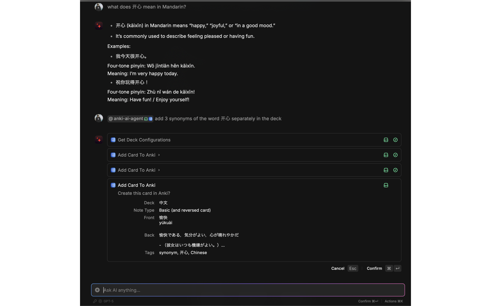
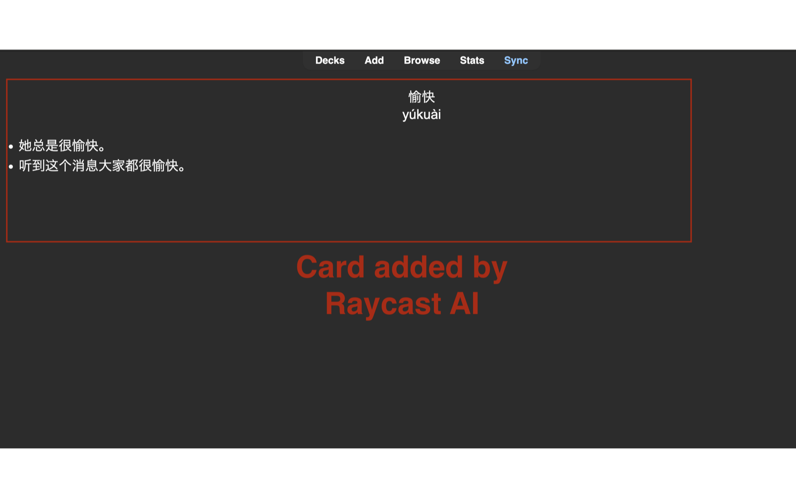
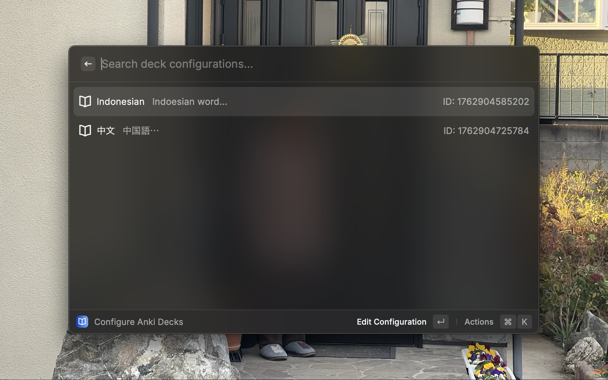
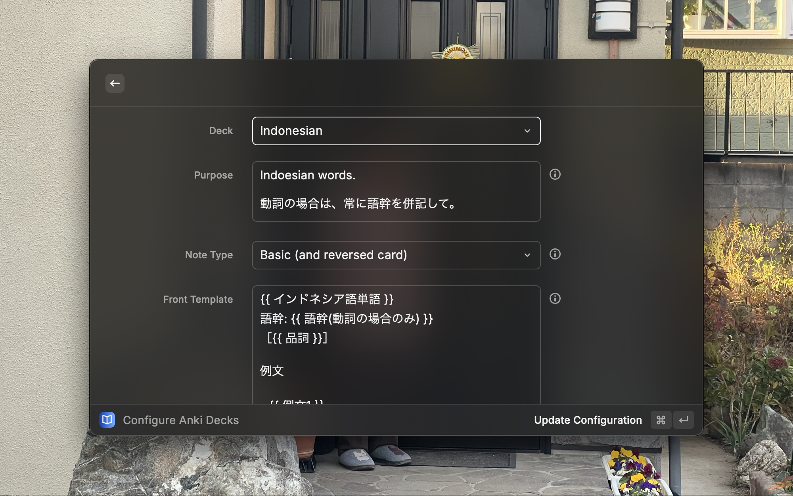

# Anki AI Agent

Create Anki flashcards through natural conversation with AI in Raycast.

## Screenshots




## Setup

### 1. Install Prerequisites

- **[Anki Desktop](https://apps.ankiweb.net/)** - Must be running while using this extension
- **[AnkiConnect Plugin](https://ankiweb.net/shared/info/2055492159)** - Install in Anki (code: `2055492159`)
- **Raycast Pro** - Required for AI features

### 2. Configure Your Decks

Run **"Configure Anki Decks"** command in Raycast and set up each deck:



#### Complete Example: Spanish Vocabulary Deck

Here's a real example showing how to set up a structured deck for Spanish vocabulary:

**Purpose:**
```
Spanish vocabulary words with multiple example sentences
```

**Front Template:**
```
Spanish Word
[Part of Speech]

Example Sentences:
- Sentence 1
- Sentence 2
```

**Front Example:**
```
hablar
[verb]

Example Sentences:
- Ella habla tres idiomas.
- Necesito hablar contigo.
```

**Back Template:**
```
Meanings:
- Meaning 1
- Meaning 2

Translations:
- (Translation 1)
- (Translation 2)

Notes:
Additional context or usage tips

Related: other related words
```

**Back Example:**
```
Meanings:
- to speak
- to talk

Translations:
- (She speaks three languages.)
- (I need to talk with you.)

Notes:
Regular -ar verb. Commonly used in everyday conversation.

Related: habla (speech), hablante (speaker)
```

This structured approach helps the AI understand exactly how to format your cards. You can use simple or complex templates depending on your needs.

---

When configuring your deck, you'll need to fill in:

**Deck** - Select an existing deck from your Anki collection (e.g., `Japanese::Vocabulary`)

**Note Type** - Choose your card format:
- **Basic** - One-sided card (Front → Back only)
- **Basic (and reversed card)** - Two-sided card (both Front → Back and Back → Front)

**Purpose, Templates, and Examples** - Follow the pattern shown in the example above. The AI uses your templates and examples as formatting guidelines.

### 3. Create Cards

In Raycast AI Chat, mention `@anki-ai-agent`:

```
@anki-ai-agent Add a card: 食べる (taberu) means "to eat"
```

```
@anki-ai-agent Add these Spanish words: casa (house), perro (dog), gato (cat)
```

```
@anki-ai-agent Create a flashcard about the subjunctive mood
```

The AI will:
1. Select the appropriate deck based on your configurations
2. Format the card according to your templates
3. Check for duplicates
4. Ask for confirmation before creating

## Features

- **AI-powered deck selection** - Automatically picks the right deck based on content
- **Smart formatting** - AI follows your template guidelines and examples
- **Markdown support** - Use **bold**, *italic*, `code`, lists in card fields
- **Duplicate detection** - Warns if similar cards already exist
- **Batch operations** - Create multiple cards in one message
- **Confirmation dialogs** - Review before creating each card
