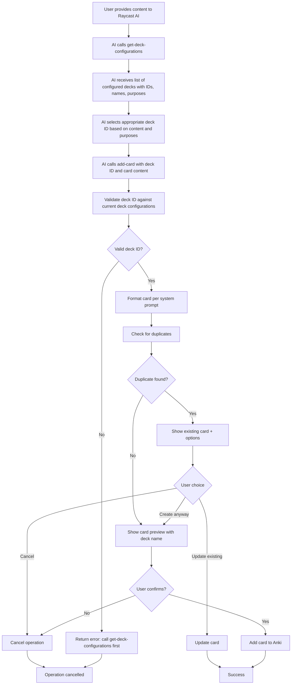

# Raycast Anki AI Extension Specification

## Overview

A Raycast AI extension that enables Raycast AI to add cards to Anki deck(s) in formats specified by users. The extension is primarily designed for language studying but is not limited to that use case.

## Prerequisites

- Anki desktop application installed and running
- AnkiConnect plugin installed (code: `2055492159`)
- Raycast Pro subscription (required for AI extensions)

## Core Requirements

### Must-Have Features

1. **Card Creation with Confirmation**
   - Always confirm with user before adding cards to Anki
   - Use Raycast's built-in confirmation feature

2. **Correct Deck Selection**
   - Add cards to the correct deck based on user's desired destination
   - Use pre-configured deck configuration to determine target deck

### Nice-to-Have Features (Built into the `add-card` tool)

1. **Automatic Duplicate Handling**
   - Before creating a card, check for existing similar cards
   - If found: show the existing card and offer to update or create new
   - All updates require user confirmation

## Configuration System

### Deck Configuration

- **Configuration Method**: Dedicated Raycast command with List UI (not an AI tool)
- **Storage**: JSON format in Raycast's LocalStorage
- **Configuration Structure**: Users explicitly add only the decks they want to use
- **Purpose**: Each configured deck has a purpose description to help AI select the right deck

### User Interaction Model

- **Deck Specification**: Users specify deck in a structured way without explicitly mentioning it every time
- **Format Specification**: Card format is given in system prompt that users can configure as a preset in Raycast AI Chat
- **Card Type**: Either proposed by AI or configured in the system prompt
- **Format Support**: Up to users to decide what card formats they want to use

## Extension Components

### 1. AI Tool: `get-deck-configurations`

A read-only AI tool that allows the AI to discover available decks:
- Returns list of configured deck configurations with ID, name, and purpose
- AI must call this FIRST before calling `add-card`
- Helps AI select the appropriate deck based on user's content and deck purposes
- No side effects, just returns current configuration

**Output Format:**
```json
[
  {
    "id": 1234567890,
    "name": "Japanese::Vocabulary",
    "purpose": "for Japanese vocabulary words"
  },
  {
    "id": 9876543210,
    "name": "Spanish::Grammar",
    "purpose": "for Spanish grammar concepts"
  }
]
```

### 2. AI Tool: `add-card`

A single AI tool that handles the entire card creation workflow:
- Receives content from user via Raycast AI
- Accepts deck ID (number) from configured deck configurations
- Validates deck ID against current deck configurations (prevents accidental use of unconfigured decks)
- Formats card based on user's system prompt configuration
- Automatically checks for duplicates before creating
- Shows confirmation with preview (displays deck name for clarity)
- If duplicate found: offers to update existing or create new
- Creates or updates card in Anki via AnkiConnect
- If called with invalid deck ID: returns helpful error message instructing AI to call `get-deck-configurations` first

### 3. Configuration Command

A separate Raycast command (non-AI) that provides a List interface where users can:
- View their configured deck configurations
- Add new deck configurations (select deck → assign purpose)
- Remove deck configurations they no longer need
- Store deck configurations in Raycast's LocalStorage

Users only configure the decks they want to use, not all available decks.

### 3. Storage Layer

- **Format**: JSON
- **Location**: Raycast's extension storage
- **Contents**: Deck configurations and user preferences

## Technical Integration

### AnkiConnect Communication

The extension communicates with Anki via AnkiConnect API on:
- Host: `127.0.0.1`
- Port: `8765`
- Protocol: HTTP with JSON payloads

### Required AnkiConnect Operations

1. **Deck Operations**
   - `deckNames`: List available decks
   - `deckNamesAndIds`: Get deck identifiers

2. **Note Operations**
   - `addNote`: Create cards
   - `findNotes`: Search for duplicates
   - `updateNoteFields`: Update existing cards
   - `notesInfo`: Get card details

3. **Model Operations**
   - `modelNames`: List available note types
   - `modelFieldNames`: Get fields for note types

## User Flow

### Card Creation Flow (with built-in duplicate detection)



### Configuration Flow

1. User runs the "Configure Anki Decks" command
2. Sees a List view with:
   - Currently configured deck configurations (if any)
   - Action to add new deck configuration
   - Actions to remove existing deck configurations
3. When adding a deck configuration:
   - Fetches available decks from Anki
   - User selects a deck from dropdown/list
   - User enters a purpose description (e.g., "for Japanese vocabulary")
   - Deck configuration is saved to LocalStorage
4. AI tool uses these deck configurations to determine the correct deck based on content

## Error Handling

### Connection Issues
- Detect if Anki is not running
- Detect if AnkiConnect is not installed
- Provide clear error messages to user

### Invalid Operations
- Validate deck exists before attempting to add cards
- Validate note type compatibility
- Handle field mapping errors

## Data Structures

### Deck Configuration Storage
```typescript
interface DeckConfiguration {
  deckId: number;  // Anki deck ID (unique identifier)
  deckName: string;  // Human-readable deck name
  purpose: string;  // Description to help AI select appropriate deck
}
```

### Card Confirmation Data
```typescript
interface CardConfirmation {
  deck: string;
  noteType: string;
  fields: Record<string, string>;
  tags?: string[];
}
```

## Implementation Structure

The extension will include:
- Two AI tools configured in `package.json`:
  - `get-deck-configurations`: Read-only tool to retrieve configured decks
  - `add-card`: Tool to create cards using deck IDs
- One configuration command as a separate Raycast command
- AnkiConnect client for HTTP communication
- Storage utilities for deck configurations

## AI Instructions

The AI should follow this workflow:
1. When user requests to add a card, ALWAYS call `get-deck-configurations` first
2. Analyze the returned deck list (ID, name, purpose) to select the most appropriate deck
3. Call `add-card` with the selected deck ID and card content
4. If `add-card` returns an error about invalid deck ID, retry from step 1

## Success Criteria

- Cards are added to correct decks based on configuration
- User always confirms before cards are created
- Configuration persists between sessions
- Clear error messages when Anki or AnkiConnect unavailable
- Duplicate detection prevents unwanted duplicates